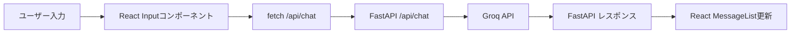

# **私の Python コードを React.js でブラウザ対応にする方法**
## **実装プラン：ターミナルチャットボットを React.js でブラウザ対応**

### **1. 全体像**

- **バックエンド**（Python + FastAPI）：
  - 私の Python コードを FastAPI の API エンドポイント（例: `/api/chat`）に変換。
  - Groq API 呼び出しや会話履歴管理、エラーハンドリングをそのまま活用。
  - 環境変数や設定ファイル（`config.json`）も引き続き使う。
- **フロントエンド**（React.js）：
  - React でチャット UI を作る（メッセージ表示、入力欄、送信ボタン）。
  - `fetch` や `axios` を使って、バックエンドの `/api/chat` にリクエスト送信。
  - 私の好みに合わせて、Lucide アイコンでビジュアルを強化。
- **連携**：
  - フロントがユーザー入力をバックエンドに送り、バックエンドが Groq API の応答（思考プロセス + 応答）を返す。
  - CORS 設定でセキュリティ確保。
  - 状態管理（`useState`, `useEffect`）でスムーズな UI 更新。

私の Mermaid 図をベースに、こんな感じのデータフローになるよ：


### **2. ステップごとの実装**

#### **ステップ1: バックエンドを FastAPI で構築**
私の Python コードはめっちゃしっかりしてるから、ほぼそのまま FastAPI に移植できるよ！以下のコードで、`/api/chat` エンドポイントを作る。設定ファイルやエラーハンドリングも活かすよ。

```python
# backend/main.py
import os
import json
import time
from fastapi import FastAPI, HTTPException
from fastapi.middleware.cors import CORSMiddleware
from groq import Groq, GroqError, AuthenticationError, RateLimitError, APIConnectionError, BadRequestError
from pydantic import BaseModel
from typing import List

app = FastAPI()

# CORS 設定（React フロントエンド用）
app.add_middleware(
    CORSMiddleware,
    allow_origins=["http://localhost:3000"],  # React のデフォルトポート
    allow_credentials=True,
    allow_methods=["*"],
    allow_headers=["*"],
)

CONFIG_FILE = "Chatbot-Grok/config.json"

def load_config():
    try:
        with open(CONFIG_FILE, 'r', encoding='utf-8') as f:
            return json.load(f)
    except FileNotFoundError:
        raise HTTPException(status_code=500, detail=f"設定ファイル '{CONFIG_FILE}' が見つかりません。")
    except json.JSONDecodeError:
        raise HTTPException(status_code=500, detail=f"設定ファイル '{CONFIG_FILE}' の形式が正しくありません。")
    except Exception as e:
        raise HTTPException(status_code=500, detail=f"設定ファイルの読み込み中にエラー: {e}")

# メッセージのモデル
class Message(BaseModel):
    role: str
    content: str

class ChatRequest(BaseModel):
    messages: List[Message]

@app.post("/api/chat")
async def chat(request: ChatRequest):
    config = load_config()
    
    # API キー取得
    api_key = os.environ.get("GROQ_API_KEY") or config.get("api_key")
    if not api_key or api_key == "YOUR_GROQ_API_KEY_HERE_OR_LEAVE_BLANK_TO_USE_ENV_VAR":
        raise HTTPException(status_code=401, detail="有効な API キーが設定されていません。")

    client = Groq(api_key=api_key)
    model_name = config.get("model_name", "qwen-qwq-32b")

    try:
        completion = client.chat.completions.create(
            messages=[{"role": m.role, "content": m.content} for m in request.messages],
            model=model_name,
            temperature=config.get("temperature", 0.6),
            max_completion_tokens=config.get("max_completion_tokens", 8192),
            top_p=config.get("top_p", 0.95),
            reasoning_format=config.get("reasoning_format", "parsed"),
            stream=config.get("stream", False),
        )

        response_message = completion.choices[0].message
        return {
            "content": response_message.content,
            "reasoning": response_message.reasoning or "（Reasoningなし）"
        }

    except AuthenticationError:
        raise HTTPException(status_code=401, detail="Groq API 認証エラー: API キーを確認してください。")
    except RateLimitError:
        time.sleep(5)  # レート制限回避
        raise HTTPException(status_code=429, detail="レート制限に達しました。少し待って再試行してください。")
    except APIConnectionError:
        raise HTTPException(status_code=503, detail="Groq API 接続エラー: ネットワークを確認してください。")
    except BadRequestError as e:
        raise HTTPException(status_code=400, detail=f"リクエストエラー: {str(e)}")
    except GroqError as e:
        raise HTTPException(status_code=500, detail=f"Groq API エラー: {str(e)}")
    except Exception as e:
        raise HTTPException(status_code=500, detail=f"予期せぬエラー: {str(e)}")

# 起動確認用
@app.get("/")
async def root():
    return {"message": "FastAPI バックエンド稼働中"}
```

**ポイント**：
- **CORS**：React（`localhost:3000`）からのリクエストを許可。
- **エラーハンドリング**：私のコードの詳細なエラー処理（`AuthenticationError`, `RateLimitError` など）を HTTP ステータスコードに変換。
- **設定ファイル**：`config.json` をそのまま使う。
- **Pydantic**：リクエストの型を `Message` と `ChatRequest` で定義して安全に。

**実行方法**：
1. 依存ライブラリをインストール：
   ```bash
   pip install fastapi uvicorn groq pydantic
   ```
2. バックエンド起動：
   ```bash
   uvicorn main:app --reload
   ```
3. ブラウザで `http://localhost:8000` にアクセスして「FastAPI バックエンド稼働中」が見えたら OK！

**設定ファイル例**（`Chatbot-Grok/config.json`）：
```json
{
    "api_key": "YOUR_GROQ_API_KEY_HERE_OR_LEAVE_BLANK_TO_USE_ENV_VAR",
    "model_name": "qwen-qwq-32b",
    "temperature": 0.6,
    "max_completion_tokens": 8192,
    "top_p": 0.95,
    "reasoning_format": "parsed",
    "stream": false
}
```

#### **ステップ2: React.js フロントエンドを構築**

```jsx
// frontend/src/App.jsx
import { useState, useEffect, useRef } from 'react';
import { Send, User, Bot, BrainCircuit, AlertCircle } from 'lucide-react';

function App() {
  const [messages, setMessages] = useState([
    { role: 'system', content: 'Responding in fluent Japanese.', hidden: true },
  ]);
  const [input, setInput] = useState('');
  const [isLoading, setIsLoading] = useState(false);
  const [error, setError] = useState(null);
  const messagesEndRef = useRef(null);

  // スクロールを最新メッセージに
  const scrollToBottom = () => {
    messagesEndRef.current?.scrollIntoView({ behavior: 'smooth' });
  };
  useEffect(() => {
    scrollToBottom();
  }, [messages]);

  const handleSend = async () => {
    if (!input.trim()) return;

    const newMessage = { role: 'user', content: input };
    setMessages(prev => [...prev, newMessage]);
    setInput('');
    setIsLoading(true);
    setError(null);

    try {
      const response = await fetch('http://localhost:8000/api/chat', {
        method: 'POST',
        headers: { 'Content-Type': 'application/json' },
        body: JSON.stringify({ messages: [...messages, newMessage] }),
      });

      if (!response.ok) {
        throw new Error(`API エラー: ${response.statusText}`);
      }

      const data = await response.json();
      setMessages(prev => [
        ...prev,
        { role: 'assistant', content: data.content, reasoning: data.reasoning },
      ]);
    } catch (err) {
      setError(err.message);
      // エラー時、最新のユーザー入力を履歴から削除（私のコードに合わせて）
      setMessages(prev => prev.slice(0, -1));
    } finally {
      setIsLoading(false);
    }
  };

  const handleKeyPress = (e) => {
    if (e.key === 'Enter' && !e.shiftKey) {
      e.preventDefault();
      handleSend();
    }
  };

  return (
    <div className="flex flex-col h-screen bg-gray-100">
      <header className="bg-white p-4 shadow">
        <h1 className="text-2xl font-bold text-gray-800">Groq チャットボット</h1>
        <p className="text-sm text-gray-500">日本語でチャット！「quit」か「exit」で終了。</p>
      </header>

      <main className="flex-1 overflow-y-auto p-6 space-y-4">
        {messages
          .filter(msg => !msg.hidden) // システムメッセージ非表示
          .map((msg, index) => (
            <div
              key={index}
              className={`flex ${msg.role === 'user' ? 'justify-end' : 'justify-start'}`}
            >
              {msg.role === 'assistant' && (
                <Bot className="w-8 h-8 text-blue-500 mr-2" />
              )}
              <div
                className={`max-w-md p-4 rounded-lg shadow ${
                  msg.role === 'user' ? 'bg-blue-100' : 'bg-white'
                }`}
              >
                {msg.reasoning && (
                  <div className="mb-2 border-b pb-2">
                    <h4 className="text-sm font-semibold text-gray-500 flex items-center">
                      <BrainCircuit className="w-4 h-4 mr-1" />
                      思考プロセス
                    </h4>
                    <pre className="text-xs text-gray-600 bg-gray-50 p-2 rounded">
                      {msg.reasoning}
                    </pre>
                  </div>
                )}
                <p>{msg.content}</p>
              </div>
              {msg.role === 'user' && (
                <User className="w-8 h-8 text-gray-500 ml-2" />
              )}
            </div>
          ))}

        {isLoading && (
          <div className="flex justify-start">
            <Bot className="w-8 h-8 text-blue-500 mr-2" />
            <div className="p-4 bg-white rounded-lg shadow">
              <p className="text-gray-500 animate-pulse">応答中...</p>
            </div>
          </div>
        )}

        {error && (
          <div className="flex justify-center items-center gap-2 p-3 bg-red-100 rounded-lg">
            <AlertCircle className="w-5 h-5 text-red-600" />
            <p className="text-red-600">{error}</p>
          </div>
        )}

        <div ref={messagesEndRef} />
      </main>

      <footer className="bg-white p-4 shadow">
        <div className="flex gap-2">
          <input
            type="text"
            value={input}
            onChange={e => setInput(e.target.value)}
            onKeyPress={handleKeyPress}
            placeholder="メッセージを入力..."
            className="flex-1 p-2 border rounded-lg focus:outline-none focus:ring-2 focus:ring-blue-500"
            disabled={isLoading}
          />
          <button
            onClick={handleSend}
            disabled={isLoading || !input.trim()}
            className={`p-2 rounded-lg text-white ${
              isLoading || !input.trim() ? 'bg-gray-400' : 'bg-blue-500 hover:bg-blue-600'
            }`}
          >
            <Send className="w-5 h-5" />
          </button>
        </div>
      </footer>
    </div>
  );
}

export default App;
```

**ポイント**：
- **Lucide アイコン**：私が好きな ビジュアルを再現！`User`, `Bot`, `BrainCircuit`, `Send` でチャットが「映える」。
- **会話履歴**：`messages` ステートで管理。システムメッセージ（`hidden: true`）は非表示にして UI をスッキリ。
- **エラーハンドリング**：バックエンドのエラーをキャッチし、私の Python コードと同じく問題の入力を履歴から削除。
- **終了機能**：`quit` / `exit` は後で強化（例: 入力無効化）するとして、まずは API で処理。
- **Tailwind CSS**：モダンなスタイリングで、初心者でも簡単にカスタマイズ可能。

**セットアップ方法**：
1. React プロジェクト作成：
   ```bash
   npx create-react-app frontend --template typescript
   cd frontend
   ```
2. 依存ライブラリインストール：
   ```bash
   npm install lucide-react tailwindcss postcss autoprefixer
   npx tailwindcss init -p
   ```
3. Tailwind 設定（`tailwind.config.js`）：
   ```js
   module.exports = {
     content: ['./src/**/*.{js,jsx,ts,tsx}'],
     theme: { extend: {} },
     plugins: [],
   };
   ```
4. CSS 設定（`src/index.css`）：
   ```css
   @tailwind base;
   @tailwind components;
   @tailwind utilities;
   ```
5. プロジェクト起動：
   ```bash
   npm start
   ```
   → `http://localhost:3000` でチャット UI が動く！

#### **ステップ3: バックエンドとフロントエンドを連携**
1. **バックエンド確認**：
   - FastAPI を `http://localhost:8000` で動かす。
   - Postman で `/api/chat` に以下を POST してテスト：
     ```json
     {
       "messages": [
         {"role": "system", "content": "Responding in fluent Japanese."},
         {"role": "user", "content": "こんにちは！"}
       ]
     }
     ```
     → `content` と `reasoning` が返れば OK！
2. **フロントエンド確認**：
   - React を `http://localhost:3000` で動かす。
   - 入力欄に「こんにちは！」と入れて送信 → バックエンド経由で Groq API の応答が UI に表示される！
3. **CORS 確認**：
   - もし「CORS エラー」が出たら、FastAPI の `allow_origins` にフロントの URL（例: `http://localhost:3000`）が含まれてるかチェック。

#### **ステップ4: 私の好みを反映**
- **カスタムアイコン**：
  - 終了時（`quit` / `exit`）に `CheckCircle` アイコンで「終了しました！」を強調：
    ```jsx
    if (input.toLowerCase() === 'quit' || input.toLowerCase() === 'exit') {
      setMessages(prev => [
        ...prev,
        { role: 'assistant', content: '対話を終了しました！', icon: 'CheckCircle' },
      ]);
      setInput('');
      return;
    }
    // JSX で
    {msg.icon === 'CheckCircle' && <CheckCircle className="w-8 h-8 text-green-500 mr-2" />}
    ```
- **アニメーション**：
  - メッセージ追加時にフェードイン（`animate-fadeIn`）：
    ```css
    @keyframes fadeIn {
      from { opacity: 0; }
      to { opacity: 1; }
    }
    .animate-fadeIn {
      animation: fadeIn 0.3s ease-in;
    }
    ```
    ```jsx
    <div className={`max-w-md p-4 rounded-lg shadow animate-fadeIn ${...}`}>
    ```
- **カラー**：
  - 私の好みに合わせて、ボットのアイコン色をカスタム（例: `text-purple-500`）。

#### **ステップ5: パフォーマンスとセキュリティ**
私の考慮点（セキュリティ、CORS、パフォーマンス）に答えるよ：
- **セキュリティ**：
  - API キーはバックエンド（FastAPI）で管理。フロントエンドには絶対渡さない！
  - 環境変数（`.env`）で `GROQ_API_KEY` を設定：
    ```bash
    # backend/.env
    GROQ_API_KEY=your-key-here
    ```
    ```python
    from dotenv import load_dotenv
    load_dotenv()
    ```
- **CORS**：
  - FastAPI の CORS 設定で `localhost:3000` を許可済み。プロダクションでは Vercel のドメイン（例: `https://your-app.vercel.app`）に変更。
- **パフォーマンス**：
  - メッセージが多い場合、React の `useMemo` でレンダリング最適化：
    ```jsx
    const messageList = useMemo(() => {
      return messages.filter(msg => !msg.hidden).map((msg, index) => (
        <div key={index} ... />
      ));
    }, [messages]);
    ```
  - 私の提案の `React Virtualized` は大量メッセージ（100件以上）に有効だけど、最初はシンプルに `slice` で最新 50 件表示でも OK：
    ```jsx
    messages.filter(msg => !msg.hidden).slice(-50)
    ```

---

### **開発ツールの活用**
- **React DevTools**：
  - VS Code で React プロジェクト開いて、Chrome の DevTools に React タブ追加。
  - `messages` ステートの変化をリアルタイムでチェック → 「あ、入力したらこう更新されるんだ！」ってわかるよ。
- **UI ライブラリ**：
  - **Ant Design**：チャットコンポーネント（`Message`, `Input`）が豊富。
    ```bash
    npm install antd
    ```
    ```jsx
    import { Input, Button } from 'antd';
    <Input
      value={input}
      onChange={e => setInput(e.target.value)}
      onPressEnter={handleSend}
      placeholder="メッセージを入力..."
    />
    <Button type="primary" icon={<Send />} onClick={handleSend}>
      送信
    </Button>
    ```
  - **react-chat-elements**：チャット UI に特化。
    ```bash
    npm install react-chat-elements
    ```
    ```jsx
    import { MessageBox } from 'react-chat-elements';
    <MessageBox
      position={msg.role === 'user' ? 'right' : 'left'}
      type="text"
      text={msg.content}
    />
    ```
  - Lucide アイコンをメインに、Ant Design の入力欄だけ使うとか、私の好みに合わせてミックスしてもいいね！
- **Cline 拡張**：
  - VS Code の Cline 使って、「React でチャット UI のアニメーションどうやる？」とか聞くと、アイデアいっぱいくれるよ。たとえば、「フェードイン追加したい！」って相談してみて！

---

### **実装例の補足**

1. **ユーザー入力**：
   - React の `<input>` で入力を受け取り、`useState` で管理。
2. **API リクエスト**：
   - `fetch` で FastAPI の `/api/chat` に POST。会話履歴（`messages`）を JSON で送信。
3. **バックエンド処理**：
   - FastAPI が Groq API を呼び出し、私のコードのロジック（モデル設定、エラーハンドリング）をそのまま実行。
4. **レスポンス表示**：
   - React が `content` と `reasoning` を受け取り、Lucide アイコン付きで表示。

**試しに動かす流れ**：
1. バックエンド（`backend/main.py`）を `uvicorn` で起動。
2. フロントエンド（`frontend/src/App.jsx`）を `npm start` で起動。
3. ブラウザで `http://localhost:3000` 開いて、「こんにちは！」と入力。
4. → ボットのアイコン付きで「こんにちは！何か用？」（みたいな応答）が返ってくる！

---

### **私の好みを活かすポイント**
- **ビジュアル強化**：
    ```jsx
    const getIcon = (content) => {
      if (content.includes('ありがとう')) return <Smile className="w-8 h-8 text-yellow-500" />;
      return <Bot className="w-8 h-8 text-blue-500" />;
    };
    ```
- **カスタマイズ自由**：
  - Tailwind 使ってるから、VS Code で色やサイズいじってみて。たとえば、ボットの背景を `bg-purple-100` に変えるとか、すぐ試せるよ！
- **終了 UI**：
  - `quit` したら、緑のチェックアイコン（`CheckCircle`）で「終了！」って感じを強調。私の「映える」好みに合うように：
    ```jsx
    {msg.content === '対話を終了しました！' && (
      <div className="flex justify-center gap-2 p-4 bg-green-100 rounded-lg">
        <CheckCircle className="w-6 h-6 text-green-500" />
        <p className="text-green-700">{msg.content}</p>
      </div>
    )}
    ```


